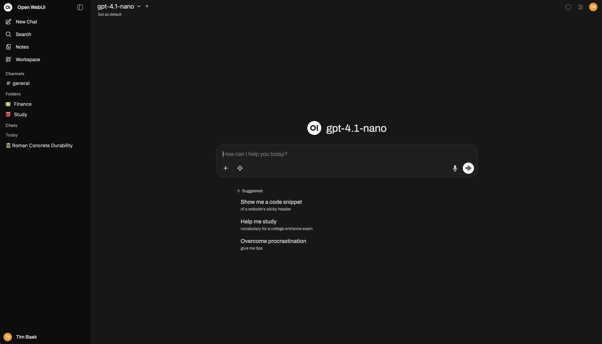

# Open WebUI 中文定制版


本仓库基于 [Open WebUI](https://github.com/open-webui/open-webui) 进行本地化和使用体验优化，目标是提供一个更适合中文用户、自托管部署和后续 Docker Hub 镜像发布的 AI Web 平台。

Open WebUI 是一个可扩展、功能丰富、易用的自托管 AI 平台。它支持 Ollama、OpenAI 兼容 API、本地 RAG、网页检索、多模型会话、权限管理、语音/视频、图片生成等能力，可用于个人知识库、团队 AI 助手、私有化模型入口和生产环境部署。



## 本仓库定制内容

- 折叠功能中文化：折叠、展开、全部折叠、全部展开等相关按钮和无障碍文案已统一改为中文。
- 整条消息级折叠：用户消息中的文字、图片、普通文件会一起折叠；助手回复中的状态、附件、嵌入内容、正文、错误、引用、代码执行结果和追问建议也会一起折叠。
- 更新提示默认关闭：默认禁用 GitHub 版本检测和更新弹窗，避免每次启动或进入页面时反复提示。
- Docker 拉取部署准备：`docker-compose.pull.yml` 已加入版本检测关闭配置，并默认指向后续 Docker Hub 镜像 `pinkmoone/open_webui:v1.3`。
- 中文部署说明：README、Compose 注释和关键部署变量面向中文环境整理。

## 功能亮点

- 快速部署：支持 Docker、Docker Compose、Python pip、Kubernetes、Helm 等方式。
- Ollama 集成：可直接连接本机、Docker 宿主机或远程服务器上的 Ollama。
- OpenAI 兼容 API：支持 OpenAI、LM Studio、Groq、Mistral、OpenRouter 以及其他兼容 OpenAI 协议的服务。
- 本地 RAG：支持文档上传、知识库、向量数据库和 `#` 命令检索引用。
- 网页检索和网页读取：可接入 SearXNG、Google PSE、Brave Search、Bing、DuckDuckGo、Tavily、Perplexity 等搜索服务。
- 多模型对话：可同时调用多个模型，便于对比不同模型的回答质量。
- 图片生成与编辑：支持 OpenAI、Gemini、ComfyUI、AUTOMATIC1111 等图像工作流。
- 语音和视频能力：支持多种语音识别与语音合成服务。
- 权限和用户组：支持角色、权限、用户组、模型访问控制等管理能力。
- 企业集成：支持 LDAP、Active Directory、OAuth、可信请求头、SCIM 2.0 等身份体系。
- 云文件接入：支持 Google Drive、OneDrive、SharePoint 等文件来源。
- 可观测性：支持 OpenTelemetry，便于接入追踪、指标和日志系统。
- 横向扩展：可使用 Redis 会话和 WebSocket 配置支持多实例部署。
- 插件和 Pipelines：可通过 Pipelines 扩展函数调用、限流、监控、翻译、内容过滤等能力。

更多上游功能说明可参考 [Open WebUI 官方文档](https://docs.openwebui.com/)。

## 快速开始

### 方式一：使用 Docker Compose 从源码构建

适合本仓库开发、二次修改和本地镜像重构。

```bash
docker compose up -d --build
```

默认访问地址：

```text
http://localhost:3000
```

如果需要调整端口，可在启动前设置：

```bash
OPEN_WEBUI_PORT=8080 docker compose up -d --build
```

### 方式二：使用 Docker Compose 拉取镜像

适合 Docker Hub 镜像发布后的生产部署。当前拉取文件默认镜像为：

```text
pinkmoone/open_webui:v1.3
```

启动 Open WebUI：

```bash
docker compose -f docker-compose.pull.yml up -d
```

同时启动 Ollama：

```bash
docker compose -f docker-compose.pull.yml --profile ollama up -d
```

指定镜像或标签：

```bash
OPEN_WEBUI_IMAGE=pinkmoone/open_webui OPEN_WEBUI_TAG=v1.3 docker compose -f docker-compose.pull.yml up -d
```

### 方式三：直接运行 Docker 镜像

如果 Ollama 在当前宿主机运行：

```bash
docker run -d \
  -p 3000:8080 \
  --add-host=host.docker.internal:host-gateway \
  -e OLLAMA_BASE_URL=http://host.docker.internal:11434 \
  -e ENABLE_VERSION_UPDATE_CHECK=false \
  -v open-webui:/app/backend/data \
  --name open-webui \
  --restart unless-stopped \
  pinkmoone/open_webui:v1.3
```

如果只使用 OpenAI 或兼容 OpenAI 的 API：

```bash
docker run -d \
  -p 3000:8080 \
  -e OPENAI_API_BASE_URL=https://api.openai.com/v1 \
  -e OPENAI_API_KEY=your_secret_key \
  -e ENABLE_VERSION_UPDATE_CHECK=false \
  -v open-webui:/app/backend/data \
  --name open-webui \
  --restart unless-stopped \
  pinkmoone/open_webui:v1.3
```

> Docker Hub 镜像完成重构发布前，可先使用本地构建或临时替换为你已经推送的镜像标签。

## Python pip 安装

如果不使用 Docker，也可以通过 pip 安装。建议使用 Python 3.11。

```bash
pip install open-webui
open-webui serve
```

默认访问地址：

```text
http://localhost:8080
```

## 重要环境变量

| 变量名 | 默认值 | 说明 |
| --- | --- | --- |
| `OPEN_WEBUI_PORT` | `3000` | WebUI 对外访问端口 |
| `OLLAMA_BASE_URL` | `http://ollama:11434` | Ollama 服务地址 |
| `OPENAI_API_BASE_URL` | 空 | OpenAI 或兼容 API 地址 |
| `OPENAI_API_KEY` | 空 | OpenAI 或兼容 API 密钥 |
| `WEBUI_SECRET_KEY` | 空 | 生产环境建议设置固定随机值 |
| `WEBUI_OPENING_CODE` | 空 | 打开页面验证码，留空表示禁用 |
| `WEBUI_OPENING_CODE_EXPIRES_MINUTES` | `10` | 打开页面验证码有效时间 |
| `ENABLE_VERSION_UPDATE_CHECK` | `false` | 是否启用版本检测和更新提示 |
| `SCARF_NO_ANALYTICS` | `true` | 禁用 Scarf 分析 |
| `DO_NOT_TRACK` | `true` | 请求应用不要追踪 |
| `ANONYMIZED_TELEMETRY` | `false` | 禁用匿名遥测 |

## Ollama 连接说明

根据 Ollama 的运行位置选择不同地址：

- Compose 文件同时启动 Ollama：`http://ollama:11434`
- Ollama 在 Docker 宿主机上：`http://host.docker.internal:11434`
- Ollama 在另一台服务器上：`http://服务器IP:11434`

如果容器无法访问宿主机上的 Ollama，可尝试 host 网络模式：

```bash
docker run -d \
  --network=host \
  -e OLLAMA_BASE_URL=http://127.0.0.1:11434 \
  -e ENABLE_VERSION_UPDATE_CHECK=false \
  -v open-webui:/app/backend/data \
  --name open-webui \
  --restart unless-stopped \
  pinkmoone/open_webui:v1.3
```

使用 host 网络模式时，访问地址通常变为：

```text
http://localhost:8080
```

## 数据持久化

Docker 部署时必须挂载数据目录，否则容器重建后数据库、配置、上传文件和用户数据可能丢失。

推荐挂载方式：

```bash
-v open-webui:/app/backend/data
```

`docker-compose.pull.yml` 中默认使用：

```yaml
volumes:
  - ${OPEN_WEBUI_DATA_DIR:-open-webui}:/app/backend/data
```

如需落到宿主机目录，可设置：

```bash
OPEN_WEBUI_DATA_DIR=./data docker compose -f docker-compose.pull.yml up -d
```

## 离线模式

如果部署在离线环境，可以设置：

```bash
HF_HUB_OFFLINE=1
```

这会避免部分组件尝试从 Hugging Face Hub 下载模型或资源。

## 更新部署

源码构建方式：

```bash
git pull
docker compose up -d --build
```

镜像拉取方式：

```bash
docker compose -f docker-compose.pull.yml pull
docker compose -f docker-compose.pull.yml up -d
```

如需切换镜像版本：

```bash
OPEN_WEBUI_TAG=v1.3 docker compose -f docker-compose.pull.yml pull
OPEN_WEBUI_TAG=v1.3 docker compose -f docker-compose.pull.yml up -d
```

## 常见问题

### 页面能打开，但连接不上 Ollama

优先检查 `OLLAMA_BASE_URL` 是否指向容器内可访问的地址。容器中的 `127.0.0.1` 指的是容器自身，不是宿主机。

常用修正：

```bash
OLLAMA_BASE_URL=http://host.docker.internal:11434
```

或在 Compose 中同时启动 Ollama：

```bash
docker compose -f docker-compose.pull.yml --profile ollama up -d
```

### 每次都弹出更新提示

本仓库默认关闭版本检测：

```bash
ENABLE_VERSION_UPDATE_CHECK=false
```

如需重新开启，可设置为：

```bash
ENABLE_VERSION_UPDATE_CHECK=true
```

### Docker Hub 镜像还没有发布

可以先使用源码构建：

```bash
docker compose up -d --build
```

镜像发布后，再使用 `docker-compose.pull.yml` 切换到 Docker Hub 拉取部署。

## 开发与二次修改

安装依赖：

```bash
npm install
```

运行前端开发服务：

```bash
npm run dev
```

运行检查：

```bash
npm run check
```

当前项目继承了上游较多历史类型诊断。如果 `npm run check` 输出大量 Svelte/TypeScript 旧问题，应先区分是否与本次修改相关，再逐步治理。

## 许可证

本项目包含多种许可证来源。当前代码包含 Open WebUI License 许可内容，并要求保留 “Open WebUI” 品牌标识；部分历史贡献仍遵循其原始许可证。

详细信息请查看：

- [LICENSE](./LICENSE)
- [LICENSE_HISTORY](./LICENSE_HISTORY)

## 上游项目

本仓库基于 Open WebUI 进行维护和定制。感谢上游项目和社区贡献者。

- 上游仓库：[open-webui/open-webui](https://github.com/open-webui/open-webui)
- 官方文档：[docs.openwebui.com](https://docs.openwebui.com/)

## 星标历史

<a href="https://star-history.com/#pinkmoone/open_webui&Date">
  <picture>
    <source media="(prefers-color-scheme: dark)" srcset="https://api.star-history.com/svg?repos=pinkmoone/open_webui&type=Date&theme=dark" />
    <source media="(prefers-color-scheme: light)" srcset="https://api.star-history.com/svg?repos=pinkmoone/open_webui&type=Date" />
    
  </picture>
</a>
